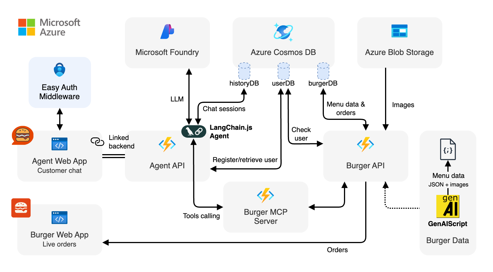
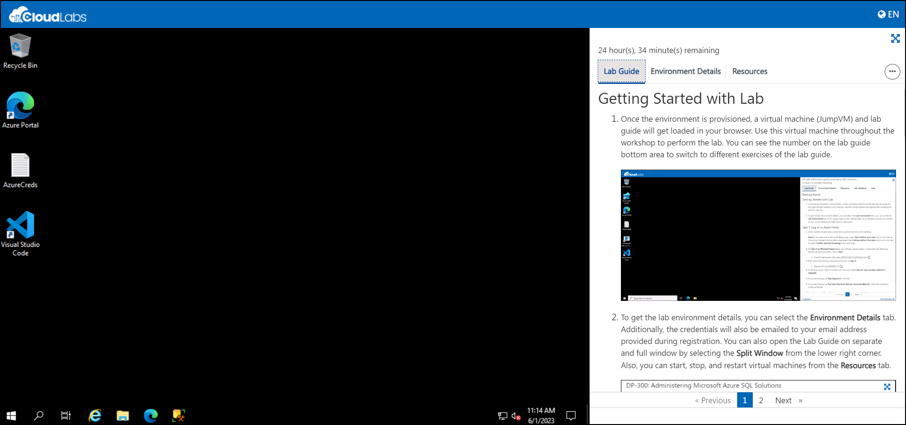
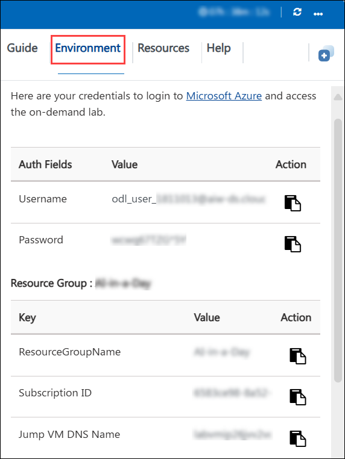
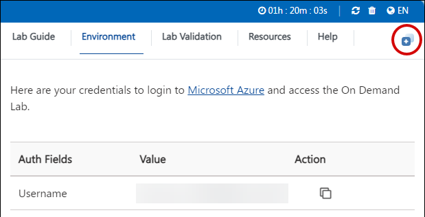
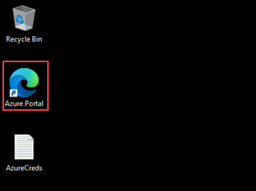
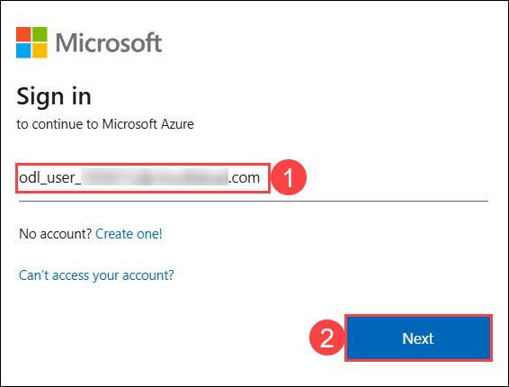
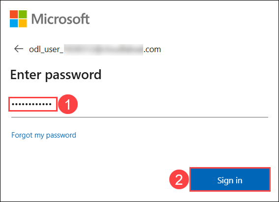
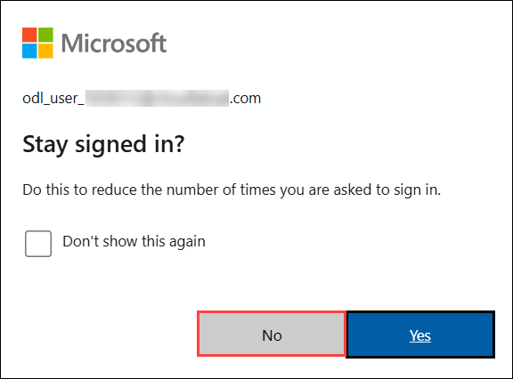

# Implementing a Serverless AI Agent with LangChain.js and Model Context Protocol

### Overall Estimated Duration: 5 hours 30 minutes

## Overview

In this lab, you will build and deploy a fully functional serverless AI agent powered by **LangChain.js** and the **Model Context Protocol (MCP)**. The agent is modeled as a burger ordering assistant called **Contoso Burgers**, where you will interact with a chat interface to browse the menu, place orders, and track their order history — all through natural language.

By the end of this lab, you will have a fully operational AI agent running on Azure that demonstrates how the Model Context Protocol bridges the gap between large language models and real-world APIs.

## Objective

This lab is designed to help you understand and apply the concepts of AI agent development, serverless architecture, and the Model Context Protocol (MCP) on Azure. By the end of this lab, you will be able to:

- **Deploy a Production-Ready Serverless AI Architecture:**
Run a multi-service solution on Azure using pre-configured infrastructure, bringing together APIs, storage, and web applications into a fully functional system.
- **Enable an AI Agent to Reason and Act:**
Configure an LLM-powered agent and observe how it interprets user intent and dynamically invokes backend tools through the Model Context Protocol (MCP).
- **Explore and Extend Agent Capabilities:**
Interact with the system, validate its behavior, and enhance it by introducing new tool functionality—experiencing how AI agents can be adapted to real-world scenarios.

## Pre-requisites

Before starting this lab, it is helpful to have:

- **Basic Azure familiarity:** Comfort navigating the Azure Portal and understanding core concepts like resource groups and services at a high level.

- **Foundational JavaScript/TypeScript knowledge:** Ability to recognize common constructs such as functions, objects, and imports when reviewing code snippets.

- **Command-line basics:** Familiarity with running commands in a terminal (e.g., navigating directories and executing scripts).

- **General awareness of AI concepts:** A high-level understanding of large language models (LLMs) and chat-based assistants.

- **VS Code environment ready:** Access to Visual Studio Code with GitHub Copilot available for use.

## Architecture

The solution follows a serverless, multi-service architecture where each component has a focused role. User interactions begin in the Agent Web App and are sent to the Agent API, which hosts the LangChain.js agent responsible for understanding intent and deciding next actions.

Instead of directly calling backend services, the agent interacts with the Burger MCP Server using the Model Context Protocol (MCP). This layer exposes a set of tools that represent real capabilities, allowing the agent to remain decoupled from the underlying business logic.

The MCP server forwards these tool calls to the Burger API, which processes requests and stores data in Azure Cosmos DB. Responses flow back through the same path to the user, enabling a seamless and dynamic chat experience.

This layered design separates reasoning, execution, and data handling, making the system easier to scale and extend.

## Architecture Diagram

   

## Explanation of Components

The architecture is composed of a small set of focused services that work together to separate user interaction, AI reasoning, business logic, and data persistence.

- **User Interaction & Entry Points:**  
  The system exposes two frontends using Azure Static Web Apps. The Agent Web App serves as the conversational interface where users interact with the AI agent, while the Burger Web App acts as a live order dashboard. Authentication is handled seamlessly through Azure Easy Auth, ensuring each request carries user identity without additional implementation effort.

- **AI Reasoning & Tool Orchestration:**  
  The core intelligence resides in the Agent API (Azure Function), which hosts the LangChain.js agent. It interprets user intent, maintains chat context, and determines when to invoke tools instead of responding directly. Rather than calling APIs itself, the agent communicates with the Burger MCP Server, which exposes a standardized set of tools using the Model Context Protocol (MCP). This abstraction allows the same tools to be reused across multiple clients, including web apps and IDE integrations.

- **Business Logic & Data Layer:**  
  The Burger API encapsulates all domain-specific operations such as managing menu data and processing orders. It interacts with Azure Cosmos DB, which stores application state across three logical areas: orders and menu data, user profiles, and chat history. Azure Blob Storage complements this by serving static assets like menu images, keeping binary data separate from structured data.

- **Platform Services & Observability:**  
  Supporting services such as Azure Application Insights and Log Analytics provide visibility into system behavior, enabling monitoring and debugging across all components. Managed Identities are used throughout to securely connect services (e.g., Functions to Cosmos DB and Storage) without relying on credentials, reinforcing a secure, production-ready design.

## Getting Started with Lab

Welcome to your Get Started with Azure OpenAI Service Workshop! We've prepared a seamless environment for you to explore and learn about Azure services. Let's begin by making the most of this experience.

## Accessing Your Lab Environment

1. Once you're ready to dive in, your virtual machine and the **Guide** will be right at your fingertips within your web browser.

   

## Virtual Machine & Lab Guide
 
Your virtual machine is your workhorse throughout the workshop. The lab guide is your roadmap to success.

## Lab Guide Zoom In/Zoom Out

1. To adjust the zoom level for the environment page, click the **A↕ : 100%** icon located next to the timer in the lab environment.

   

## Exploring Your Lab Resources
 
To get a better understanding of your lab resources and credentials, navigate to the **Environment** tab.

   

## Utilizing the Split Window Feature
 
For your convenience, you can open the lab guide in a separate window by selecting the **Split Window** button from the top right corner.

  
## Managing Your Virtual Machine
 
Feel free to **Start, Restart, or Stop (2)** your virtual machine as needed from the **Resources (1)** tab. Your experience is in your hands!
 

## Let's Get Started with Azure Portal
 
1. On your virtual machine, click on the **Azure Portal** icon as shown below:
 
      
    
2. You'll see the **Sign in to continue to Microsoft Azure** tab. Here, enter your credentials:
 
   - **Email/Username:** <inject key="AzureAdUserEmail"></inject>
 
       
 
3. Next, provide your password:
 
   - **Password:** <inject key="AzureAdUserPassword"></inject>
 
      
 
4. In the **Stay signed in?** pop-up, click **No**.
       
      

 
## Support Contact

The CloudLabs support team is available 24/7, 365 days a year, via email and live chat to ensure seamless assistance at any time. We offer dedicated support channels tailored specifically for both learners and instructors, ensuring that all your needs are promptly and efficiently addressed.

Learner Support Contacts:

- Email Support: cloudlabs-support@spektrasystems.com

- Live Chat Support: https://cloudlabs.ai/labs-support

Now, click on **Next** from the lower right corner to move on to the next page.

## Happy Learning!!
