# Exercise 01: Provision Azure OpenAI and Connect the MCP Agent Infrastructure

### Estimated Duration: 1 Hour 30 Minutes

## Exercise Overview

Your lab environment already has the full Contoso Burgers application infrastructure deployed and waiting for you — all **five Azure services** are live in your resource group, wired together, and ready to run. The only missing piece is **your Azure OpenAI credentials**, which connect the AI Agent to its language model brain.

In this exercise, you will deploy an **Azure OpenAI resource and model** from the Azure Portal, then clone the application repository to your local machine, configure a `.env` file with your credentials and the pre-provisioned service URLs, install dependencies, and deploy the application code to all five services using the Azure Developer CLI.

By the end of this exercise, the full Contoso Burgers stack will be operational — Agent Web App, Agent API, Burger MCP Server, Burger API, and Burger Web App — all serving live traffic.

## Exercise Objectives

In this exercise, you will complete the following tasks:

- **Task 1:** Deploy an Azure OpenAI Resource and Model
- **Task 2:** Clone the Repository and Configure the Deployment Environment

---

## Task 1: Deploy an Azure OpenAI Resource and Model

The agent in this exercise uses Azure OpenAI to perform all its reasoning — understanding your message, deciding which tools to call, and composing a natural language reply. Before deploying the application, you need an Azure OpenAI resource and a deployed model. In this task, you will create the resource, deploy a model, and save your credentials to use in the next task.

> **Note:** Azure OpenAI resources must be created in a region that supports the model you intend to deploy. The exercise uses **East US 2** as the default region. If your subscription has capacity constraints, **Sweden Central** or **North Europe** are good alternatives.

### Steps

1. In the **Azure Portal**, use the top search bar to search for **Azure OpenAI (1)** and select **Azure OpenAI (2)** from the results.

   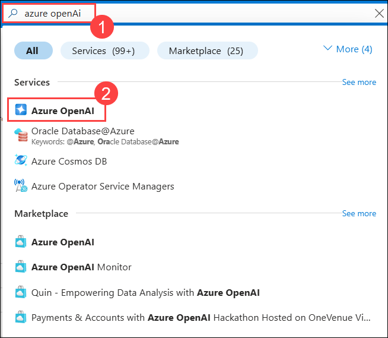

2. On the **Azure AI Foundry | Azure OpenAI** blade, click **+ Create**.

   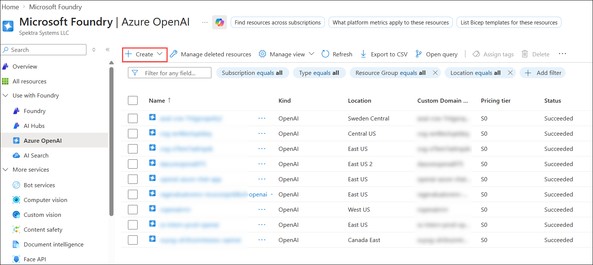

3. On the **Create Azure OpenAI** blade, fill in the following details, then click **Next** three times to reach the **Review + submit** tab:

   | Setting            | Value                                                                  |
   | ------------------ | ---------------------------------------------------------------------- |
   | **Subscription**   | Your lab subscription                                                  |
   | **Resource group** | <inject key="ResourceGroupName"></inject>                              |
   | **Region**         | **East US 2**                                                          |
   | **Name**           | **openai-mcp-<inject key="DeploymentID" enableCopy="false"></inject>** |
   | **Pricing tier**   | **Standard S0**                                                        |

   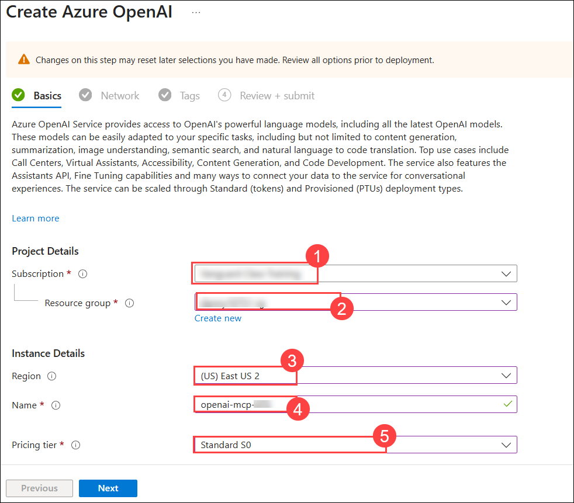

   > **Why this resource group?** Your lab environment has a single pre-provisioned resource group. All resources in this lab must be created inside it so that role assignments and service connections work correctly.

4. On the **Review + submit** tab, click **Create** and wait for the deployment to complete. This typically takes 1–2 minutes.

5. Once deployment is complete, click **Go to resource**.

6. On your Azure OpenAI resource blade, navigate to **Keys and Endpoint (2)** under **Resource Management (1)**. Click **Show Keys (3)**, then copy **Key 1 (4)** and the **Endpoint (5)** URL. Paste both into a text editor — you will need them shortly.

   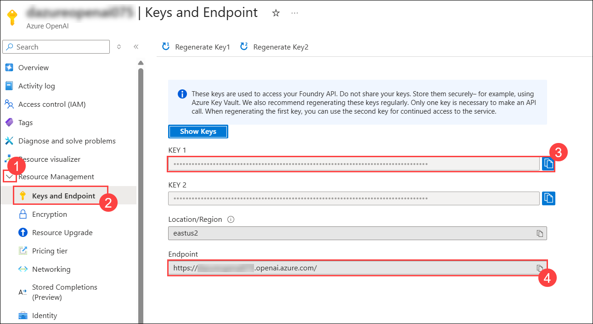

   > **Keep these safe.** Your Key 1 and Endpoint are the credentials the Agent API will use to call your model. You will pass them as environment variables during deployment — never hard-code them into source files.

7. Click **Go to Azure AI Foundry portal** (by navigating to the overview page) to open the model deployment interface.

   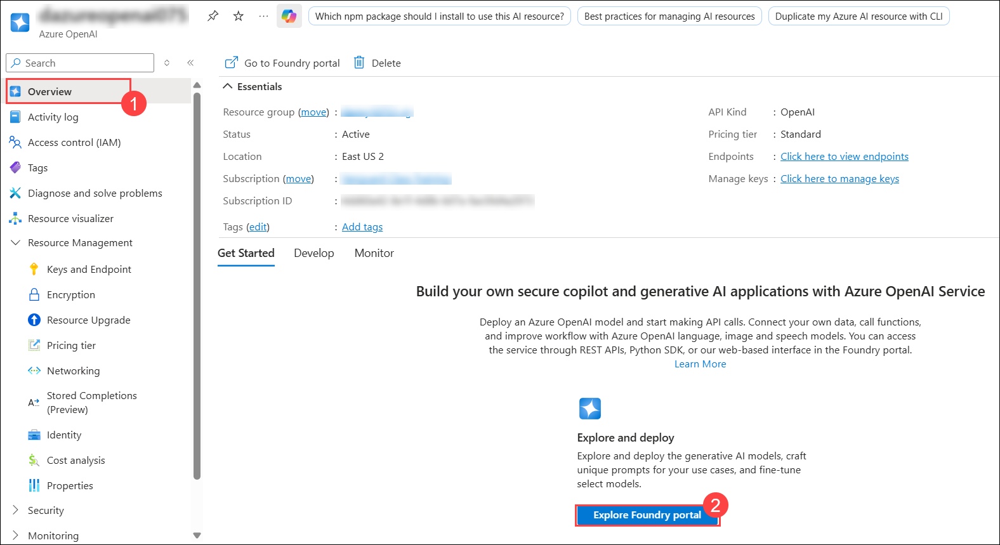

8. In the left navigation, under **Shared resources**, select **Deployments (1)**, then click **+ Deploy model (2)** → **Deploy base model (3)**.

   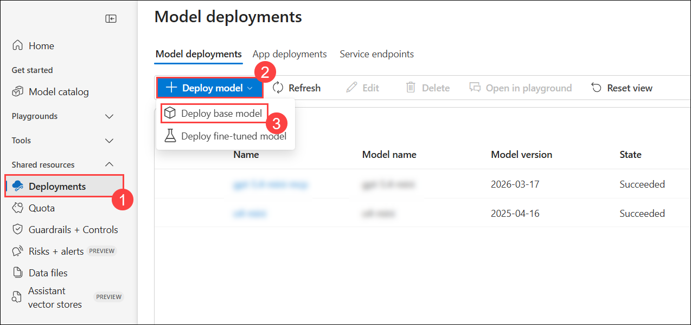

9. Search for and select the model you wish to use. The lab is compatible with any of the following — pick based on what's available in your region:
   - `o4-mini` _(recommended — fast and cost-effective)_
   - `gpt-5.2-chat`
   - `gpt-5.4-mini`

   Click **Confirm**.

10. In the deployment configuration, set the following and click **Deploy**:

    | Setting                          | Value                                                        |
    | -------------------------------- | ------------------------------------------------------------ |
    | **Deployment name**              | Give it a clear name, e.g. `gpt-5.4-mini` or your model name |
    | **Deployment type**              | Standard                                                     |
    | **Tokens per Minute Rate Limit** | 10K (or higher if available)                                 |

    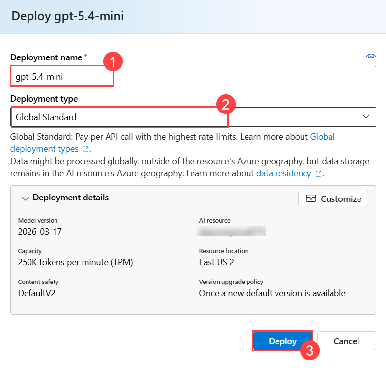

    > **Note the deployment name exactly as you typed it** — this is what you will pass as `AZURE_OPENAI_MODEL` later. It is case-sensitive.

11. Once the deployment succeeds, note the deployment name and add it to your text editor alongside your Key and Endpoint. You should now have three values saved:
    - **Endpoint** → e.g. `https://openai-mcp-XXXXXX.openai.azure.com/`
    - **Key 1** → a 32-character alphanumeric string
    - **Deployment name** → e.g. `gpt-5.4-mini`

    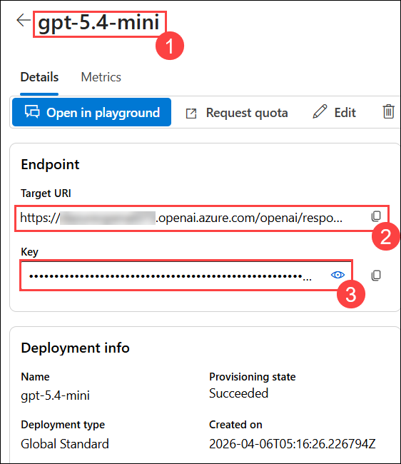

<validation step="validate-openai-deployment" />

> **Congratulations** on completing Task 1! You now have a live Azure OpenAI model ready to power the agent. Next, you will clone the application and configure the deployment.

---

## Task 2: Clone the Repository and Configure the Deployment Environment

Your resource group already contains all the Azure infrastructure — Function Apps, Cosmos DB, Storage, Static Web Apps, and Application Insights — provisioned and wired together. What they are missing is the **application code**, which needs to be deployed once from your local machine.

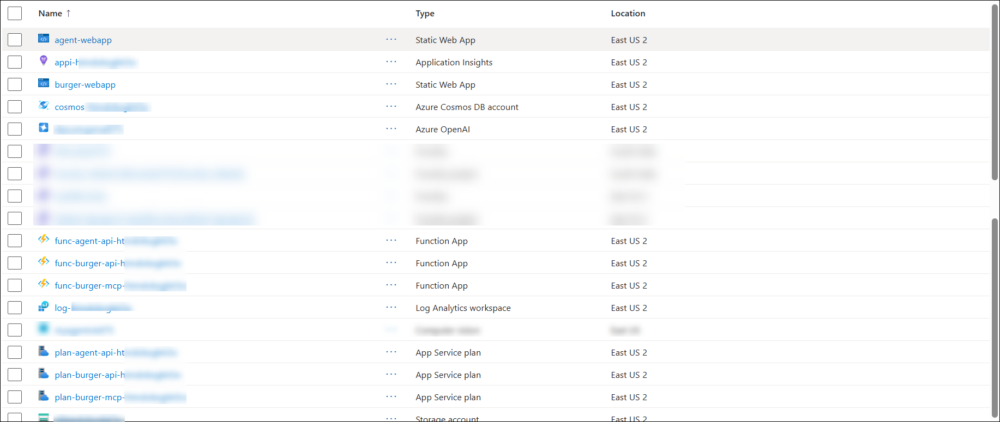

| Resource                                  | Purpose                                                     |
| ----------------------------------------- | ----------------------------------------------------------- |
| 3× Azure Function Apps (Flex Consumption) | Agent API, Burger API, Burger MCP Server                    |
| 3× App Service Plans (FC1)                | Compute plans for each Function App                         |
| 2× Azure Static Web Apps                  | Agent Web App (chat UI) + Burger Web App (orders dashboard) |
| 1× Azure Cosmos DB (Serverless, NoSQL)    | Stores burgers, orders, users, and chat history             |
| 1× Azure Storage Account                  | Function deployment packages + burger images                |
| 1× Application Insights + Log Analytics   | Telemetry and monitoring                                    |

   > Take a moment to click through each resource. Notice that the three Function Apps are all on the **Flex Consumption** plan — this is Azure's newest serverless compute tier that scales to zero when idle, meaning you only pay when the functions actually execute.

In this task, you will clone the repository, install dependencies, collect the pre-provisioned service URLs from the Azure Portal, build a `.env` file, and then use `azd` to deploy just the application code (skipping infrastructure provisioning entirely since it is already done).

> **Why `azd deploy` and not `azd up`?** `azd up` provisions infrastructure _and_ deploys code. Since your infrastructure is already live, you only need `azd deploy` — which packages and uploads the application code for each service without touching the Azure resources.

### Steps

1. Open **PowerShell** on your local machine.

2. Verify that **Node.js 22** and the **Azure Developer CLI (`azd`)** are installed by running:

   ```bash
   node --version
   azd version
   ```

   You should see Node.js version `v22.x.x` or higher and an `azd` version. If `azd` is not found, install it with:

   ```powershell
   winget install microsoft.azd
   ```

3. Clone the Contoso Burgers repository to your local machine:

   ```bash
   git clone https://github.com/Danish1875/mcp-agent-langchainjs.git
   ```

4. Navigate into the project folder and open it in **Visual Studio Code**:

   ```bash
   cd mcp-agent-langchainjs
   code .
   ```

   All remaining steps in this task are run from the **VS Code integrated terminal**. You can open a new terminal with **Ctrl+`** or via the menu **Terminal → New Terminal**.

   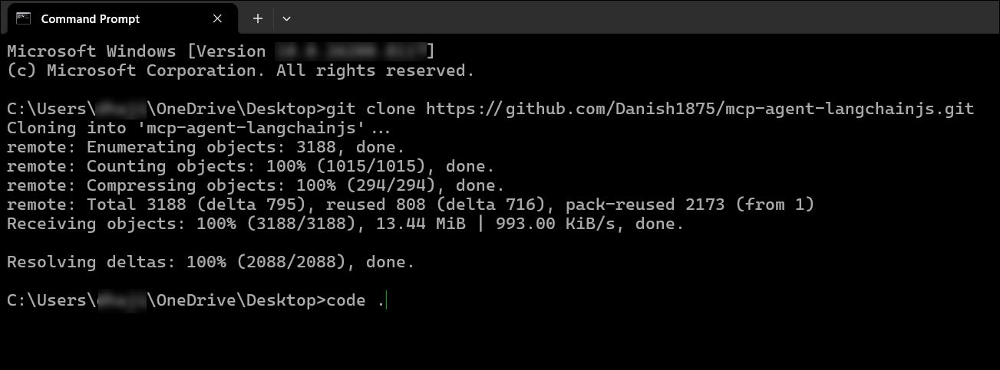

   > **Note:** These steps can also be performed using **Azure Cloud Shell in the Azure Portal** if you prefer a browser-based environment. The commands remain the same.

5. Open a new terminal in VS Code and navigate into the project root and install all Node.js dependencies. Because this project uses **npm workspaces**, a single install command handles all five packages at once (This might take 5-10 minutes on the first run)

   ```bash
   cd mcp-agent-langchainjs
   npm install
   ```

   > **Why one install?** The `package.json` at the root defines a `workspaces` array pointing to all packages under `packages/`. npm resolves and installs all dependencies for every service in one pass — no need to `cd` into each folder individually.

6. Before creating the `.env` file, you need to gather the URLs and endpoint values from the resources already deployed in your resource group. All of these are visible in the Azure Portal.

   > In the **Azure Portal**, navigate to your resource group **<inject key="ResourceGroupName"></inject>**. You will see all the pre-provisioned resources listed — Function Apps, Static Web Apps, Cosmos DB, Storage Account, and Application Insights.

7. Collect the following values and add them to your text editor alongside your OpenAI credentials. The table below tells you exactly where to find each one:

   | Value needed                      | Where to find it in the Portal                                                                          |
   | --------------------------------- | ------------------------------------------------------------------------------------------------------- |
   | **BURGER_API_URL**                | Click `func-burger-api-...` → **Overview** → copy **Default domain**, prepend `https://`                |
   | **AGENT_API_URL**                 | Click `func-agent-api-...` → **Overview** → copy **Default domain**, prepend `https://`                 |
   | **BURGER_MCP_URL**                | Click `func-burger-mcp-...` → **Overview** → copy **Default domain**, prepend `https://`, append `/mcp` |
   | **BURGER_WEBAPP_URL**             | Click `burger-webapp` (Static Web App) → **Overview** → copy **URL**                                    |
   | **AGENT_WEBAPP_URL**              | Click `agent-webapp` (Static Web App) → **Overview** → copy **URL**                                     |
   | **AZURE_COSMOSDB_NOSQL_ENDPOINT** | Click `cosmos-...` → **Overview** → copy **URI**                                                        |
   | **AZURE_STORAGE_URL**             | Click `st...` (Storage Account) → **Endpoints** → copy **Blob service** URL (without trailing slash)    |

   > **Tip:** Use the search bar at the top of the resource group blade to filter by resource type if the list is long.

8. Also collect the following two values you will need for `azd` configuration:
   - **Subscription ID** — visible in the Portal top bar or under **Subscriptions**
   - **Your Principal ID** — run this in the VS Code terminal:

   ```powershell
   az login
   az ad signed-in-user show --query id -o tsv
   ```

   Copy the GUID printed to the terminal. This is your Azure AD principal ID, which `azd` uses to assign permissions to the deployed resources.

9. In VS Code, create a new file named **`.env`** in the **root of the project** (the same level as `package.json` and `azure.yaml`).

   > **Important:** The `.env` file is already listed in `.gitignore`. It will never be committed to source control — it is local only.

10. Paste the following template into `.env` and fill in every value using what you collected above:

    ```env
    # Azure location and tenant (leave these as-is for the lab)
    AZURE_LOCATION=eastus2
    AZURE_ENV_NAME=mcp-burger-dev

    # Your Azure subscription and principal
    AZURE_SUBSCRIPTION_ID=<your-subscription-id>
    AZURE_PRINCIPAL_ID=<your-principal-id>

    # Azure OpenAI — from Task 1
    AZURE_OPENAI_API_ENDPOINT=https://<your-resource-name>.openai.azure.com/openai/deployments/<your-deployment-name>
    AZURE_OPENAI_API_KEY=<your-key-1>
    AZURE_OPENAI_MODEL=<your-deployment-name>
    OPENAI_API_VERSION=2025-01-01-preview

    # Pre-provisioned service URLs — from above
    BURGER_API_URL=https://func-burger-api-<token>.azurewebsites.net
    AGENT_API_URL=https://func-agent-api-<token>.azurewebsites.net
    BURGER_MCP_URL=https://func-burger-mcp-<token>.azurewebsites.net/mcp
    BURGER_WEBAPP_URL=https://<burger-webapp>.azurestaticapps.net
    AGENT_WEBAPP_URL=https://<agent-webapp>.azurestaticapps.net

    # Cosmos DB and Storage — from above
    AZURE_COSMOSDB_NOSQL_ENDPOINT=https://cosmos-<token>.documents.azure.com:443/
    AZURE_STORAGE_URL=https://st<token>.blob.core.windows.net
    AZURE_STORAGE_CONTAINER_NAME=blobs
    ```

    > **Endpoint format matters.** Your `AZURE_OPENAI_API_ENDPOINT` must follow this exact pattern — include `/openai/deployments/<your-deployment-name>` and nothing else after it. Do **not** add `?api-version=...`. An incorrectly formatted endpoint is the most common cause of `404 Model Not Found` errors.

    Once filled in, your `.env` file should have no `<placeholder>` values remaining.

11. Log in to Azure and create a new `azd` environment. This tells `azd` where to deploy:

    ```powershell
    azd auth login
    azd env new mcp-burger-dev
    ```

12. Load all your `.env` values into the `azd` environment so it knows the target subscription, resource group, and credentials. Run each command, substituting your own values:

    ```powershell
    azd env set AZURE_SUBSCRIPTION_ID "<your-subscription-id>"
    azd env set AZURE_RESOURCE_GROUP "<inject key="ResourceGroupName"></inject>"
    azd env set AZURE_LOCATION "eastus2"
    azd env set AZURE_OPENAI_API_ENDPOINT "<your-openai-endpoint-with-deployment-path>"
    azd env set AZURE_OPENAI_API_KEY "<your-key-1>"
    azd env set AZURE_OPENAI_MODEL "<your-deployment-name>"
    azd env set OPENAI_API_VERSION "2025-01-01-preview"
    azd env set AZURE_PRINCIPAL_ID "<your-principal-id>"
    ```

    > **Why set values in both `.env` and `azd env`?** The `.env` file is read by local tools in Exercise 02 (such as GenAIScript for seeding data). The `azd env` store is read by `azd deploy` when it packages and uploads code to Azure. Both need to be populated.

13. Confirm all variables are set:

    ```powershell
    azd env get-values
    ```

    Verify that `AZURE_OPENAI_API_ENDPOINT`, `AZURE_OPENAI_MODEL`, and `AZURE_RESOURCE_GROUP` are present and correctly formatted.

14. Now deploy the application code to all five pre-provisioned services:

    ```powershell
    azd deploy
    ```

    Because the infrastructure is already provisioned, `azd deploy` skips resource creation entirely and goes straight to packaging and uploading code. You will see output like this:

    ```
    (✓) Done: Deploying service agent-api
    (✓) Done: Deploying service agent-webapp
    (✓) Done: Deploying service burger-api
    (✓) Done: Deploying service burger-mcp
    (✓) Done: Deploying service burger-webapp
    ```

    > This typically takes **5–8 minutes**. All five services are deployed in parallel where possible.

    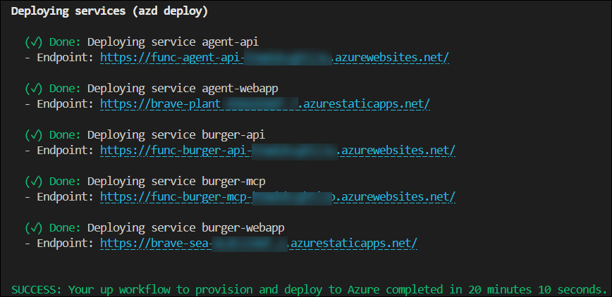

15. To verify the deployment, navigate back to the **Azure Portal** and open your resource group. Click on the **`func-agent-api-...`** Function App, then go to **Settings** → **Environment variables**. Confirm that `AZURE_OPENAI_API_ENDPOINT`, `AZURE_OPENAI_API_KEY`, `AZURE_OPENAI_MODEL`, and `BURGER_MCP_URL` are all present with your values.

    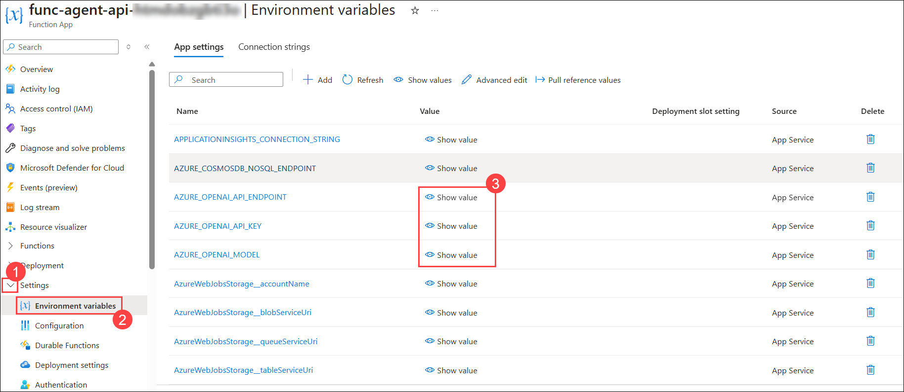

    > **Why check this?** When `azd deploy` runs, it re-applies the app settings from your `azd` environment to the Function App. If any are missing or malformed here, the agent will fail to connect to OpenAI at runtime.

16. Open your **Agent Web App URL** in a browser (from your `.env` file — `AGENT_WEBAPP_URL`). You should see the **Contoso Burgers AI Agent** login page. Sign in with your Microsoft or GitHub account.

    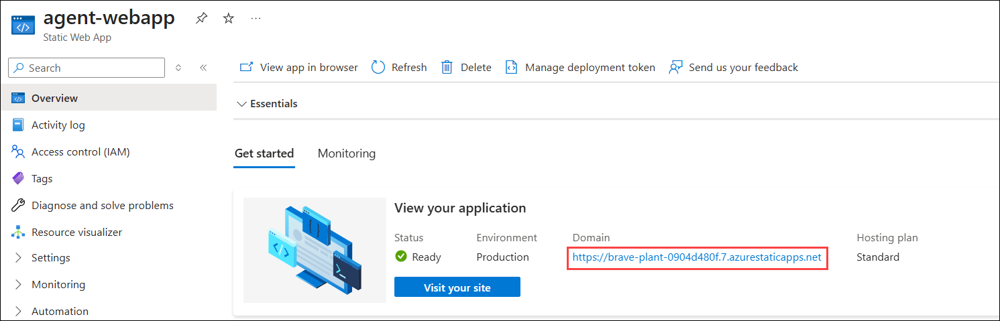

    > **Try sending a message:** _"What burgers do you have?"_

    **Expected behavior at this stage:** The chat interface will load and accept messages, but the agent will return no results or an empty response. This is completely normal — the Cosmos DB database exists and is empty. You will populate it in Exercise 02.

    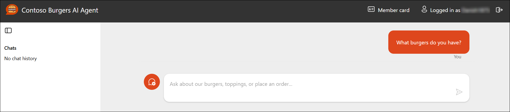

<validation step="validate-full-deployment" />
 
>**Congratulations** on completing Exercise 01! All five services are now running your application code. Your Azure OpenAI credentials are wired in, all services can communicate with each other, and Cosmos DB is ready to receive data. In Exercise 02, you will seed the burger menu and verify the full end-to-end agent flow.
---

## Summary

In this exercise, you:

- Deployed an **Azure OpenAI resource** and model from the Azure Portal and saved your endpoint, key, and deployment name
- Cloned the Contoso Burgers repository and installed all dependencies using npm workspaces
- Collected pre-provisioned service URLs from the Azure Portal and built a `.env` file at the project root
- Configured the `azd` environment and ran `azd deploy` to push application code to all five pre-provisioned services
- Verified the Agent API received the correct environment variables and confirmed the Agent Web App loads successfully

Click **Next** to proceed to Exercise 02, where you will seed the database and get the agent fully operational.


