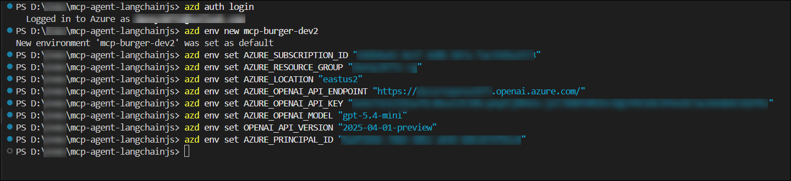

# Lab 01: Provision Azure OpenAI and Deploy the MCP Agent Infrastructure

### Estimated Duration: 1 Hour 30 Minutes

## Lab Overview

Before any AI agent can reason, plan, or call tools, it needs three things: a language model to think with, infrastructure to run on, and services wired together correctly. In this lab, you will set all three up from scratch.

You will start by deploying an **Azure OpenAI resource** and model from the Azure Portal — this is the LLM brain that powers the Contoso Burgers agent. You will then clone the application repository into Azure Cloud Shell, configure your deployment environment using the Azure Developer CLI (`azd`), and deploy the entire multi-service application to your Azure resource group in a single command.

By the end of this lab, five live Azure services will be running in your resource group, all wired together and ready for configuration — the Agent Web App, Agent API, Burger MCP Server, Burger API, and Burger Web App.

## Lab Objectives

In this lab, you will complete the following tasks:

- **Task 1:** Deploy an Azure OpenAI Resource and Model
- **Task 2:** Clone the Repository and Configure the Deployment Environment
- **Task 3:** Deploy the Full Application Stack with `azd up`

---

## Task 1: Deploy an Azure OpenAI Resource and Model

The agent in this lab uses Azure OpenAI to perform all its reasoning — understanding your message, deciding which tools to call, and composing a natural language reply. Before deploying the application, you need an Azure OpenAI resource and a deployed model. In this task, you will create the resource, deploy a model, and save your credentials to use in the next task.

> **Note:** Azure OpenAI resources must be created in a region that supports the model you intend to deploy. The lab uses **East US 2** as the default region. If your subscription has capacity constraints, **Sweden Central** or **North Europe** are good alternatives.

### Steps

1. In the **Azure Portal**, use the top search bar to search for **Azure OpenAI (1)** and select **Azure OpenAI (2)** from the results.

   

2. On the **Azure AI Foundry | Azure OpenAI** blade, click **+ Create**.

   

3. On the **Create Azure OpenAI** blade, fill in the following details, then click **Next** three times to reach the **Review + submit** tab:

   | Setting | Value |
   |---|---|
   | **Subscription** | Your lab subscription |
   | **Resource group** | <inject key="ResourceGroupName"></inject> |
   | **Region** | **East US 2** |
   | **Name** | **openai-mcp-<inject key="DeploymentID" enableCopy="false"></inject>** |
   | **Pricing tier** | **Standard S0** |

   

   > **Why this resource group?** Your lab environment has a single pre-provisioned resource group. All resources in this lab must be created inside it so that the Bicep deployment and role assignments work correctly.

4. On the **Review + submit** tab, click **Create** and wait for the deployment to complete. This typically takes 1–2 minutes.

5. Once deployment is complete, click **Go to resource**.

6. On your Azure OpenAI resource blade, navigate to **Keys and Endpoint (2)** under **Resource Management (1)**. Click **Show Keys (3)**, then copy **Key 1 (4)** and the **Endpoint (5)** URL. Paste both into a text editor — you will need them shortly.

   

   > **Keep these safe.** Your Key 1 and Endpoint are the credentials the Agent API will use to call your model. You will pass them as environment variables during deployment — never hard-code them into source files.

7. Click **Go to Azure AI Foundry portal** (by navigating to the overview page) to open the model deployment interface.

   

8. In the left navigation, under **Shared resources**, select **Deployments (1)**, then click **+ Deploy model (2)** → **Deploy base model (3)**.

   

9. Search for and select the model you wish to use. The lab is compatible with any of the following — pick based on what's available in your region:

   - `o4-mini` *(recommended — fast and cost-effective)*
   - `gpt-5.2-chat`
   - `gpt-5.4-mini`

   Click **Confirm**.

10. In the deployment configuration, set the following and click **Deploy**:

    | Setting | Value |
    |---|---|
    | **Deployment name** | Give it a clear name, e.g. `gpt-5.4-mini` or your model name |
    | **Deployment type** | Standard |
    | **Tokens per Minute Rate Limit** | 10K (or higher if available) |

    

    > **Note the deployment name exactly as you typed it** — this is what you will pass as `AZURE_OPENAI_MODEL` later. It is case-sensitive.

11. Once the deployment succeeds, note the deployment name and add it to your text editor alongside your Key and Endpoint. You should now have three values saved:

    - **Endpoint** → e.g. `https://openai-mcp-XXXXXX.openai.azure.com/`
    - **Key 1** → a 32-character alphanumeric string
    - **Deployment name** → e.g. `gpt-5.4-mini`

    

<validation step="validate-openai-deployment" />

> **Congratulations** on completing Task 1! You now have a live Azure OpenAI model ready to power the agent. Next, you will clone the application and configure the deployment.

---

## Task 2: Clone the Repository and Configure the Deployment Environment

With your OpenAI credentials ready, the next step is to get the application code and configure the Azure Developer CLI (`azd`) environment. `azd` is Microsoft's open-source tool that handles both infrastructure provisioning (via Bicep) and application code deployment — all from a single command.

In this task, you will open Azure Cloud Shell, clone the Contoso Burgers repository, install dependencies, and set all the required environment variables so `azd` knows exactly what to deploy and where.

> **What is `azd`?** The Azure Developer CLI (`azd`) bridges the gap between your code and Azure. It reads the `azure.yaml` file in the project root to understand which services exist, and the `infra/main.bicep` file to know what infrastructure to create. When you run `azd up`, it provisions the infrastructure and deploys all services in one go.

### Steps

1. Open **PowerShell** on your local machine.

2. Verify that **Node.js 22** and the **Azure Developer CLI (`azd`)** are installed by running:

   ```bash
   node --version
   azd version
   ```

   You should see Node.js version `v22.x.x` or higher and an `azd` version. If `azd` is not found, install it with:

   ```bash
   curl -fsSL https://aka.ms/install-azd.sh | bash
   ```

3. Clone the Contoso Burgers repository to your local machine:

   ```bash
   git clone https://github.com/Danish1875/mcp-agent-langchainjs.git
   ```
4. Navigate into the project folder and open it in **Visual Studio Code**:

   ```bash
   cd mcp-agent-langchainjs
   code .
   ```

   This opens the entire project workspace in VS Code so you can run the remaining commands from the integrated terminal and easily explore the project files.

   

   > **Note:** These steps can also be performed using **Azure Cloud Shell in the Azure Portal** if you prefer a browser-based environment. The commands remain the same.

5. Open a new terminal in VS Code and navigate into the project root and install all Node.js dependencies. Because this project uses **npm workspaces**, a single install command handles all five packages at once (This might take 5-10 minutes on the first run)

   ```bash
   cd mcp-agent-langchainjs
   npm install
   ```

   > **Why one install?** The `package.json` at the root defines a `workspaces` array pointing to all packages under `packages/`. npm resolves and installs all dependencies for every service in one pass — no need to `cd` into each folder individually.


6. Use `azd auth login` to log in to your Azure account, then create a new `azd` environment. This creates a named configuration store (under `.azure/`) that holds all your deployment variables:

   ```bash
   azd auth login
   azd env new mcp-burger-dev
   ```

   When prompted for an environment name, it is pre-filled from the command. Press **Enter** to confirm.

7. Now set the required environment variables. These tell `azd` which Azure subscription and resource group to deploy into, and provide your OpenAI credentials. Run each command, replacing the placeholder values with your own:

   ```bash
   azd env set AZURE_SUBSCRIPTION_ID "<your-subscription-id>"
   ```
   ```bash
   azd env set AZURE_RESOURCE_GROUP "<inject key="ResourceGroupName"></inject>"
   ```
   ```bash
   azd env set AZURE_LOCATION "eastus2"
   ```
   ```bash
   azd env set AZURE_OPENAI_API_ENDPOINT "<your-openai-endpoint>"
   ```
   ```bash
   azd env set AZURE_OPENAI_API_KEY "<your-openai-key>"
   ```
   ```bash
   azd env set AZURE_OPENAI_MODEL "<your-deployment-name>"
   ```
   ```bash
   azd env set OPENAI_API_VERSION "2025-04-01-preview"
   ```

   > **Endpoint format matters.** Your endpoint must follow this exact pattern — ending with `.openai.azure.com/` and nothing more:
   > ```
   > https://xxxx.openai.azure.com/openai/deployments/<model-name>
   > ```
   > Do **not** include `?api-version=...` — the application constructs the full URL internally. An incorrectly formatted endpoint is the most common cause of `404 Model Not Found` errors.


8. Retrieve your Azure Principal ID and set it as well — this is required so the Bicep deployment can assign the correct Cosmos DB and Storage roles to your user:

   ```bash
   az ad signed-in-user show --query id -o tsv 
   azd env set AZURE_PRINCIPAL_ID "<your-principal-id>"
   ```
   

9. Verify all your variables are set correctly:

    ```bash
    azd env get-values
    ```

    You should see all the variables you just set printed to the terminal. Confirm that `AZURE_OPENAI_API_ENDPOINT`, `AZURE_OPENAI_MODEL`, and `AZURE_RESOURCE_GROUP` are present and correctly formatted.

<validation step="validate-azd-env-configured" />

> **Congratulations** on completing Task 2! Your environment is fully configured. In the next task, you will trigger the deployment.

---

## Task 3: Deploy the Full Application Stack with `azd up`

With your environment configured, you are ready to deploy. A single `azd up` command will do two things sequentially: **provision** all Azure infrastructure defined in `infra/main.bicep`, and then **deploy** the compiled application code for all five services.

Understanding what the Bicep template creates helps you know what you're working with after deployment. The `main.bicep` file is scoped to your resource group (not the subscription), meaning it will only create resources inside the group you specified — nothing outside it. Here is what gets provisioned:

| Resource | Purpose |
|---|---|
| 3× Azure Function Apps (Flex Consumption) | Agent API, Burger API, Burger MCP Server |
| 3× App Service Plans (FC1) | Compute plans for each Function App |
| 2× Azure Static Web Apps | Agent Web App (chat UI) + Burger Web App (orders dashboard) |
| 1× Azure Cosmos DB (Serverless, NoSQL) | Stores burgers, orders, users, and chat history |
| 1× Azure Storage Account | Function deployment packages + burger images |
| 1× Application Insights + Log Analytics | Telemetry and monitoring |

> **No Azure AI Foundry provisioned here.** Because you already created your Azure OpenAI resource manually in Task 1, the Bicep template skips AI resource provisioning entirely and uses the endpoint and key you provided via `azd env set`. This keeps your deployment scoped to your resource group without needing subscription-level permissions.

### Steps

1. From the project root in Cloud Shell, run:

   ```bash
   azd up
   ```

   When prompted to confirm the subscription and location, verify they match your lab settings and press **Enter**.

2. The deployment will proceed in two phases. First, **provisioning** creates all Azure resources. Watch the output — you will see each resource appear as it's created:

   ```
   (✓) Done: App Service plan: plan-burger-api-...
   (✓) Done: Storage account: st...
   (✓) Done: Function App: func-burger-api-...
   (✓) Done: Azure Cosmos DB: cosmos-...
   ```

   This phase typically takes **8–15 minutes**. The Cosmos DB creation is the longest step.


3. After provisioning, the **deployment** phase begins automatically — `azd` packages and uploads the code for each service:

   ```
   (✓) Done: Deploying service agent-api
   (✓) Done: Deploying service agent-webapp
   (✓) Done: Deploying service burger-api
   (✓) Done: Deploying service burger-mcp
   (✓) Done: Deploying service burger-webapp
   ```

   

4. Once complete, the terminal will show `SUCCESS` and print the endpoint URL for each service. Copy these to your text editor — you will use them throughout the rest of the lab:

   ```
   - Endpoint: https://func-agent-api-XXXX.azurewebsites.net/
   - Endpoint: https://<agent-webapp>.azurestaticapps.net/
   - Endpoint: https://func-burger-api-XXXX.azurewebsites.net/
   - Endpoint: https://func-burger-mcp-XXXX.azurewebsites.net/
   - Endpoint: https://<burger-webapp>.azurestaticapps.net/
   ```

5. Pull all deployed environment values into a local `.env` file. This file is used by local tools later in the lab (such as GenAIScript for seeding burger data):

   ```bash
   azd env get-values > .env
   ```

   Then verify the file was created:

   ```bash
   cat .env
   ```

   You should see all your service URLs, the Cosmos DB endpoint, storage URL, and OpenAI settings printed out.


6. Navigate to the **Azure Portal** and open your resource group **<inject key="ResourceGroupName"></inject>**. You should see all the newly provisioned resources listed there — Function Apps, Static Web Apps, Cosmos DB, Storage Account, and Application Insights.

   

   > Take a moment to click through each resource. Notice that the three Function Apps are all on the **Flex Consumption** plan — this is Azure's newest serverless compute tier that scales to zero when idle, meaning you only pay when the functions actually execute.

7. Click on the **func-agent-api-XXXX** Function App, navigate to **Settings** → **Environment variables**, and confirm that `AZURE_OPENAI_API_ENDPOINT`, `AZURE_OPENAI_API_KEY`, `AZURE_OPENAI_MODEL`, and `BURGER_MCP_URL` are all present with your values.

   

   > **Why check this?** The Bicep template injects these values directly into the Function App's application settings during deployment. When the Node.js code runs on Azure, it reads them via `process.env`. If any are missing or malformed, the agent will fail to connect to OpenAI — which you will diagnose in Lab 02 on the next page.

8. Go back to your resource group and open the **Agent Web App** resource, then open your **Agent Web App URL** in a browser.

   
   You should see the **Contoso Burgers AI Agent** login page. Sign in with your Microsoft/Github account.
   > **Try sending a message:** *"What burgers do you have?"*
   
    **Expected behavior at this stage:** The chat interface will load and accept messages, but the agent will likely return no results or an empty response. This is normal — the Cosmos DB database is empty and has no burger data yet. You will fix this in Lab 02.

   

<validation step="validate-full-deployment" />

> **Congratulations** on completing Lab 01! All five services are now live in Azure. Your infrastructure is provisioned, your code is deployed, and your Azure OpenAI credentials are wired in. In Lab 02, you will seed the database with burger menu data and verify the full end-to-end agent flow.

---

## Summary

In this exercise, you:

- Deployed an **Azure OpenAI resource** and model from the Azure Portal and saved your API credentials
- Cloned the Contoso Burgers repository and installed all dependencies using npm workspaces
- Configured the `azd` environment with your subscription, resource group, and OpenAI credentials
- Ran `azd up` to provision all Azure infrastructure via Bicep and deploy all five application services
- Verified the deployed resources in the Azure Portal and confirmed the Agent API received the correct environment variables

Click **Next** to proceed to Lab 02, where you will seed the database and get the agent fully operational.

