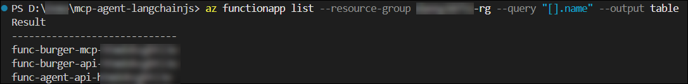
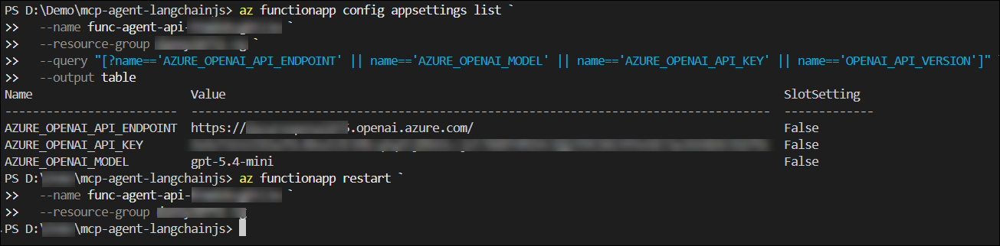
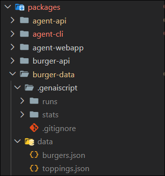
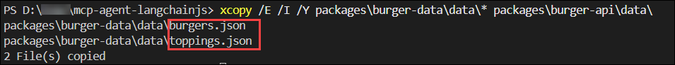
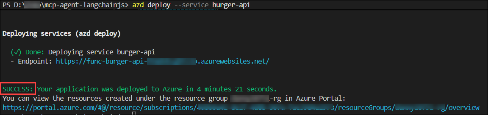
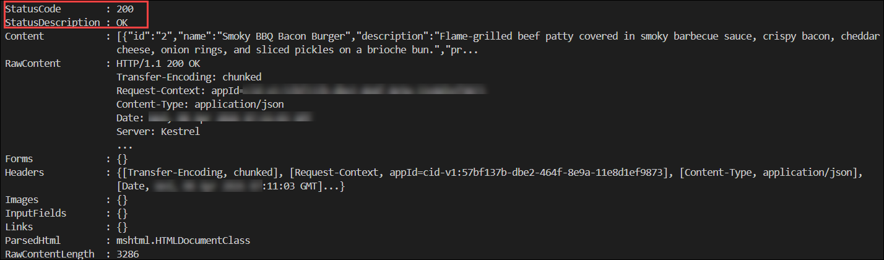
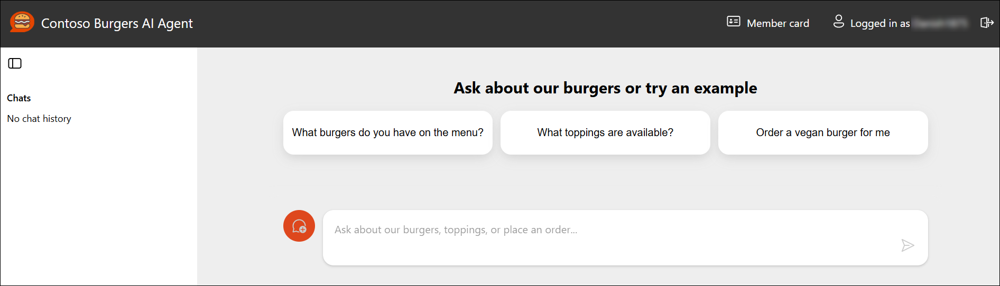
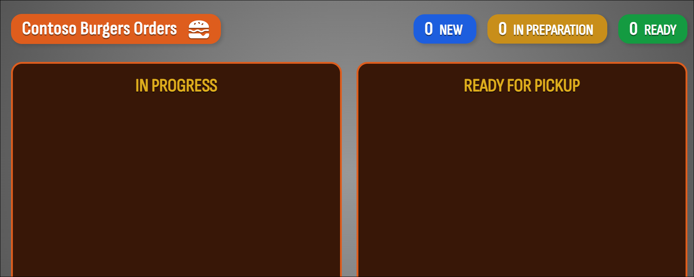

# Lab 02: Configure the Agent, Seed the Database, and Verify the Full Stack

### Estimated Duration: 1 Hour 30 Minutes

## Exercise Overview

Your five services are deployed and running, but the agent is not yet fully operational. Two things are still missing: the Agent API needs its OpenAI connection verified and the model configured correctly, and the **Cosmos DB database is empty** — meaning the MCP tools have no burger menu data to return.

In this lab, you will configure the Agent API's Function App settings to ensure the correct model and API version are wired in, then use **GenAIScript** to generate and seed the burger menu into Cosmos DB, and finally verify the complete end-to-end flow by placing a live order through the chat interface.

## Objectives

- **Task 1:** Configure the Agent API Function App with the correct OpenAI model settings
- **Task 2:** Generate and seed the burger menu data into Cosmos DB
- **Task 3:** Verify the full end-to-end agent and place your first order

---

## Task 1: Configure the Agent API Function App Settings

The Agent API reads its OpenAI configuration entirely from environment variables at runtime. The Bicep deployment already injected your endpoint, key, and model name — but the **API version**, which Azure OpenAI requires on every request, needs to be explicitly set. Without it, the underlying OpenAI SDK cannot construct a valid request URL and will return a `404 Resource Not Found` error.

In this task, you will set the missing `OPENAI_API_VERSION` setting on the Function App and verify the full configuration before restarting the service.

> **How the Agent API calls OpenAI:** Open your VSCode and navigate to the file `packages/agent-api/src/functions/chats-post.ts`. The code constructs the model client like this:

 ```typescript
 const model = new ChatOpenAI({
   configuration: {
     baseURL: azureOpenAiEndpoint,
     defaultQuery: { 'api-version': process.env.OPENAI_API_VERSION ?? '2025-01-01-preview' },
     defaultHeaders: { 'api-key': process.env.AZURE_OPENAI_API_KEY },
   },
   modelName: process.env.AZURE_OPENAI_MODEL ?? 'o4-mini',
   streaming: true,
   useResponsesApi: false,
   apiKey: process.env.AZURE_OPENAI_API_KEY ?? getAzureOpenAiTokenProvider(),
 });
 ```

> The `defaultQuery` appends `?api-version=...` to every request automatically. The `baseURL` must be your endpoint **without** any path suffix — just `https://your-resource.openai.azure.com/`. The SDK builds the full URL from there. Male sure to change the `modelName` to match your deployment name.

### Steps

1. In **Azure Cloud Shell**, run the following command to confirm what is currently set on the Agent API Function App. Replace the function app name with yours from Lab 01:

   ```bash
   az functionapp config appsettings list \
     --name <your-agent-api-function-app-name> \
     --resource-group <inject key="ResourceGroupName"></inject> \
     --query "[?name=='AZURE_OPENAI_API_ENDPOINT' || name=='AZURE_OPENAI_MODEL' || name=='AZURE_OPENAI_API_KEY' || name=='OPENAI_API_VERSION']" \
     --output table
   ```

   > **Don't know your Function App name?** Run this to list all Function Apps in your resource group:

   ```bash
   az functionapp list --resource-group <inject key="ResourceGroupName"></inject> --query "[].name" --output table
   ```
   > Look for the one prefixed with `func-agent-api-`.

   

2. If you see `OPENAI_API_VERSION` is missing. Set it now:

   ```bash
   az functionapp config appsettings set \
     --name <your-agent-api-function-app-name> \
     --resource-group <inject key="ResourceGroupName"></inject> \
     --settings OPENAI_API_VERSION="2025-01-01-preview"
   ```

3. Now verify that your `AZURE_OPENAI_API_ENDPOINT` is in the correct format. The endpoint format must look exactly like this:

   ```
   https://openai-mcp-XXXXXX.openai.azure.com/
   ```

   It must **not** contain `/openai/deployments/...`, `/chat/completions`, or `?api-version=...`. If yours includes any of these, correct it now:

   ```bash
   az functionapp config appsettings set \
     --name <your-agent-api-function-app-name> \
     --resource-group <inject key="ResourceGroupName"></inject> \
     --settings AZURE_OPENAI_API_ENDPOINT="https://<your-resource-name>.openai.azure.com/"
   ```

   > **Why does the format matter so much?** The `ChatOpenAI` client appends `/openai/deployments/<model>/chat/completions` to whatever `baseURL` you provide. If you include those path segments yourself, the final URL becomes a broken double-path like `.../openai/openai/deployments/...` — and Azure returns a 404. The endpoint should stop at the domain name.

4. Restart the Function App to apply all setting changes:

   ```bash
   az functionapp restart \
     --name <your-agent-api-function-app-name> \
     --resource-group <inject key="ResourceGroupName"></inject>
   ```

   

5. Wait 30 seconds for the Function App to restart, then do a quick smoke test. Open your **Agent Web App URL** in a browser and send a simple message like *"hi"*. 

   At this stage you may get a brief response or still see an empty reply — that is expected since the database has no burger data yet. What you should **not** see is a browser console error showing `502 Bad Gateway`. If you do, go back and double-check step 3 — the endpoint format is the most common culprit.

<validation step="validate-agent-api-settings" />

> **Congratulations** on completing Task 1! The Agent API is now correctly configured. In the next task, you will populate the database so the agent has real burger data to work with.

---

## Task 2: Generate and Seed the Burger Menu Data

The Cosmos DB instance created by `azd up` contains the correct databases and containers (`burgerDB`, `userDB`, `historyDB`) but they are all empty. The `packages/burger-data` package contains **GenAIScript** scripts that use your Azure OpenAI model to generate realistic burger and topping data, and a copy script that moves that data into the Burger API package for deployment.

> **What is GenAIScript?** It is a scripting framework by Microsoft that lets you write JavaScript scripts that call LLMs as part of their execution. Here it is used to generate burger names, descriptions, and topping combinations — then save them as JSON files. Think of it as using your LLM as a data generator.

> **Already have data files?** If `packages/burger-data/data/` already contains JSON files from a previous run, you can skip directly to step 4 — the data generation step is only needed once.

### Steps

1. GenAIScript needs your OpenAI credentials available as shell environment variables (separate from the `azd` env store). In your terminal powershell, set them for this session:

   ```powershell
   $env:AZURE_OPENAI_API_ENDPOINT="https://<your-resource-name>.openai.azure.com/"
   ```
   ```powershell
   $env:AZURE_OPENAI_API_KEY="<your-key>"
   ```
   ```powershell
   $env:AZURE_OPENAI_MODEL="<your-deployment-name>"
   ```
   ```powershell
   $env:GENAISCRIPT_DEFAULT_MODEL="azure:<your-deployment-name>"
   ```

   For example, if your deployment name is `gpt-4o-mini`:

   ```powershell
   $env:GENAISCRIPT_DEFAULT_MODEL="azure:gpt-4o-mini"
   ```

   > **These are session-only variables.** They are not saved permanently — they only exist for the duration of this Cloud Shell session. That is intentional, since data generation only needs to run once.

2. From the project root, run the burger data generation script:

   ```powershell
   npm run generate:burgers --workspace=burger-data
   ```

   This calls your Azure OpenAI model to generate a set of burgers with names, descriptions, and topping combinations. You will see the LLM prompt and response printed to the terminal as it runs.

   > This typically takes 30–60 seconds. The generated data is saved to `packages/burger-data/data/`.

3. Once complete, verify the data was created:

   ```bash
   ls packages/burger-data/data/
   ```

   You should see JSON files such as `burgers.json` and `toppings.json`.

   

4. Copy the generated data into the Burger API package using PowerShell in your vscode terminal:

   ```powershell
   xcopy /E /I /Y packages\burger-data\data\* packages\burger-api\data\
   ```

This copies all generated JSON files into the Burger API's `data` folder so they can be uploaded during the next deployment.

   

5. Redeploy the Burger API service so the newly copied data gets uploaded to Azure:

   ```bash
   azd deploy --service burger-api
   ```

   This packages and deploys only the `burger-api` service — no need to redeploy everything.

   

6. Once the deployment completes, verify the data was loaded successfully by calling the Burger API directly. Replace the URL with your Burger API endpoint from Exercise 1:

   ```bash
   Invoke-WebRequest https://<your-burger-api-url>/api/burgers
   ```

   You should receive a JSON array of burger objects. If you see an empty array `[]`, wait 30 seconds and try again — the Function App may still be warming up.

   

<validation step="validate-burger-data-seeded" />

> **Congratulations** on completing Task 2! Your Cosmos DB now has a full burger menu. The MCP tools have real data to work with. Let's test the full agent flow.

---

## Task 3: Verify the Full End-to-End Agent Flow

Everything is now in place — the Azure OpenAI model is configured, the database is seeded, and all five services are running. In this task, you will interact with the agent through the chat interface, place an order, and watch it appear live on the Burger Web App dashboard.

This task also gives you a first look at how the LangChain.js agent uses **MCP tool calls** behind the scenes — the chat interface surfaces these intermediate steps so you can see exactly what the agent is doing at each point.

### Steps

1. Open your **Agent Web App URL** in a browser and sign in if prompted. You should land on the **Contoso Burgers AI Agent** chat interface.

   

2. In a **second browser tab**, open your **Burger Web App URL**. This is the live orders dashboard — keep both tabs visible side by side if your screen allows.

   

3. Back in the Agent Web App, send this message:

   *"What burgers do you have on the menu?"*

   Watch the response stream in. You should see the agent's thinking steps appear — tool calls like `get_burgers` being invoked — followed by a formatted list of burgers with names and descriptions.

   

   > **What just happened?** The LangChain.js agent received your message, decided it needed to call the `get_burgers` MCP tool, sent that tool call to the Burger MCP Server, which in turn called `GET /api/burgers` on the Burger API, retrieved the data from Cosmos DB, and returned it up the chain. The agent then formatted the results into a readable reply. All of this happened in a single streaming response.

4. Now place an order:

   *"Order two Classic Cheeseburgers for me"*

   The agent will first call `get_burgers` to find the correct burger ID, then call `place_order` with your user ID and the burger details.

   

5. Switch to the **Burger Web App** tab. Your order should appear on the dashboard within a few seconds.

   

6. Back in the chat, check your order history:

   *"Show me my recent orders"*

   The agent will call `get_orders` and return a summary of your placed orders.

   

7. Finally, try cancelling the order:

   *"Cancel my last order"*

   The agent will call `get_orders` to find your most recent pending order, then call `delete_order_by_id` to cancel it. Notice how the agent chains two tool calls together to complete a single user request.

   

8. Reload the page and start a **new chat session**. Send the same question again: *"Show me my recent orders"*. Your order history from the previous session is still there — persisted in Cosmos DB under your user ID.

   > **Session history is per-user and persistent.** Every chat session is stored in the `historyDB` Cosmos DB container. When you start a new session, the agent starts fresh — but your order history in `burgerDB` remains intact across all sessions.

   

<validation step="validate-end-to-end-agent" />

> **Congratulations** on completing Exercise 2! The Contoso Burgers AI Agent is now fully operational. You have verified the complete flow from chat message to MCP tool call to Cosmos DB and back. In Exercise 3, you will explore the MCP tools directly, integrate the server with GitHub Copilot, and add a brand new tool to the system.

---

## Summary

In this exercise, you:

- Verified and corrected the Agent API Function App settings, ensuring the OpenAI endpoint format and API version were properly configured
- Used GenAIScript with your Azure OpenAI model to generate burger menu data and seeded it into Cosmos DB via the Burger API
- Validated the full end-to-end agent flow — from chat message to MCP tool calls to live database reads and writes
- Observed how the LangChain.js agent chains multiple tool calls to complete a single natural language request

Click **Next** to proceed to Exercise 3, where you will explore MCP tools directly and extend the agent with a new capability.

