# Exercise 4: Extend the Agent with Custom MCP Tools

### Estimated Duration: 1 Hour 30 Minutes

## Exercise Overview

You have deployed the agent, configured it, seeded the database, and explored the existing 9 MCP tools. Now it is time to go one step further — you will **add two brand new tools to the Burger MCP Server yourself**.

This is where the real power of MCP becomes clear. Adding a new capability to the agent does not require touching the LangChain.js agent code, the web app, or any prompt engineering. You define the tool in one place — the MCP server — and every connected client (the web chat, GitHub Copilot, the MCP Inspector) picks it up automatically on the next request.

The two tools you will add are:

- **`get_order_estimated_wait`** — Given an order ID, returns the order's current position in the pending queue and an estimated wait time in minutes. Useful for checking how long until your burger is ready.
- **`get_menu_recommendation`** _(GET)_ — Given a preference keyword such as `"spicy"`, `"vegan"`, or `"BBQ"`, scores every burger on the menu against that keyword and returns the top 3 matches. This adds structured, deterministic filtering on top of the raw menu data.

Both tools are **read-only** — they only fetch data, never modify it. If anything goes wrong, you can revert by simply removing the two code blocks you added and redeploying.

## Exercise Objectives

- **Task 1:** Add the two new tools to the Burger MCP Server source code
- **Task 2:** Redeploy the Burger MCP Server and verify the new tools are live
- **Task 3:** Test the new tools across the web chat and GitHub Copilot

---

## Task 1: Add the Two New Tools to the MCP Server

All MCP tools in this project are registered inside a single file: `packages/burger-mcp/src/mcp.ts`. Each tool is defined using `server.registerTool(...)` — a name, a description, an input schema, and an async handler function that fetches data from the Burger API and returns a result.

You will add two new `server.registerTool(...)` blocks to this file. You will not modify any existing code — only **append new blocks** before the final closing line of the file.

> **Before you start — take note of your Burger API URL.** Both tools call the Burger API internally. You will need to confirm the `burgerApiUrl` variable is already available in `mcp.ts` before pasting the new code. Run this to get your URL if needed:

```powershell
azd env get-values | Select-String "BURGER_API_URL"
```

### Steps

1. Open **VS Code** on your lab VM with the `mcp-agent-langchainjs` project loaded.

2. In the Explorer panel, navigate to and open the file:

   ```
   packages/burger-mcp/src/mcp.ts
   ```

   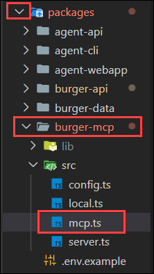

3. Scroll to the **bottom of the file**. You will see a series of `server.registerTool(...)` blocks — one for each of the 9 existing tools. Find the **last** `server.registerTool(...)` block and identify the closing `});` line that ends it.

   You will paste both new tool blocks **after** that closing `});` and **before** the final `return server;` line at the very bottom.

   > **Important:** Do not modify, delete, or move any existing code. You are only adding new blocks between the last existing tool and the `return server;` statement **(line 133)**

4. Paste the following code block for **Tool 1: `get_order_estimated_wait`** at the insert point:

   ```typescript
   // Get estimated wait time for a pending order based on queue position
   server.registerTool(
     "get_order_estimated_wait",
     {
       description:
         "Get the estimated wait time for a specific order based on its position in the pending queue. Returns queue position and estimated minutes.",
       inputSchema: z.object({
         id: z.string().describe("ID of the order to check wait time for"),
       }),
     },
     async (args) =>
       createToolResponse(async () => {
         // Fetch the specific order
         const targetOrder = await fetchBurgerApi(`/api/orders/${args.id}`);

         // If not pending, it is already being prepared or completed
         if (targetOrder.status !== "pending") {
           return {
             orderId: args.id,
             status: targetOrder.status,
             message: `Your order is currently "${targetOrder.status}" and is no longer in the pending queue.`,
           };
         }

         // Fetch all orders to count how many pending ones are ahead
         const allOrders = (await fetchBurgerApi("/api/orders")) as Array<{
           id: string;
           status: string;
           createdAt: string;
         }>;

         const pendingBefore = allOrders.filter(
           (o) =>
             o.status === "pending" &&
             new Date(o.createdAt) <= new Date(targetOrder.createdAt as string),
         );

         const position = pendingBefore.length;
         const estimatedMinutes = position * 2;

         return {
           orderId: args.id,
           status: targetOrder.status,
           queuePosition: position,
           estimatedWaitMinutes: estimatedMinutes,
           message: `Your order is number ${position} in the queue. Estimated wait time is approximately ${estimatedMinutes} minutes.`,
         };
       }),
   );
   ```

5. Immediately after Tool 1's closing `);`, paste the following block for **Tool 2: `get_menu_recommendation`**:

   ```typescript
   // Get burger recommendations based on a preference keyword
   server.registerTool(
     "get_menu_recommendation",
     {
       description:
         'Get burger recommendations based on a preference keyword such as "spicy", "vegan", "vegetarian", "classic", or "BBQ". Returns up to 3 matching burgers from the menu.',
       inputSchema: z.object({
         preference: z
           .string()
           .describe(
             'A preference keyword to filter burgers by, e.g. "spicy", "vegan", "classic", "BBQ", "vegetarian"',
           ),
       }),
     },
     async (args) =>
       createToolResponse(async () => {
         const burgers = (await fetchBurgerApi("/api/burgers")) as Array<{
           id: string;
           name: string;
           description: string;
         }>;

         const pref = args.preference.toLowerCase();

         // Score each burger by how well its name and description match the preference
         const scored = burgers.map((burger) => {
           const text = `${burger.name} ${burger.description}`.toLowerCase();
           let score = 0;
           if (text.includes(pref)) score += 3;
           for (const word of pref.split(/\s+/)) {
             if (word.length > 3 && text.includes(word)) score += 1;
           }
           return { ...burger, score };
         });

         const matches = scored
           .filter((b) => b.score > 0)
           .sort((a, b) => b.score - a.score)
           .slice(0, 3)
           .map(({ id, name, description }) => ({ id, name, description }));

         if (matches.length === 0) {
           return {
             preference: args.preference,
             recommendations: [],
             message: `No burgers found matching "${args.preference}". Try: "spicy", "vegetarian", "vegan", "classic", or "BBQ".`,
           };
         }

         return {
           preference: args.preference,
           recommendations: matches,
           message: `Found ${matches.length} burger(s) matching "${args.preference}".`,
         };
       }),
   );
   ```

6. Verify the final structure of the bottom of `mcp.ts` looks like this — the two new blocks sit between the last existing tool and `return server;`:

   ```typescript
   // ... existing tools above ...

   server.registerTool('delete_order_by_id', { ... }, async (...) => { ... });   // last existing tool

   server.registerTool('get_order_estimated_wait', { ... }, async (...) => { ... });   // NEW Tool 1

   server.registerTool('get_menu_recommendation', { ... }, async (...) => { ... });    // NEW Tool 2

   return server;   // this line must remain last
   ```

    > Tool should be inserted as shown:

    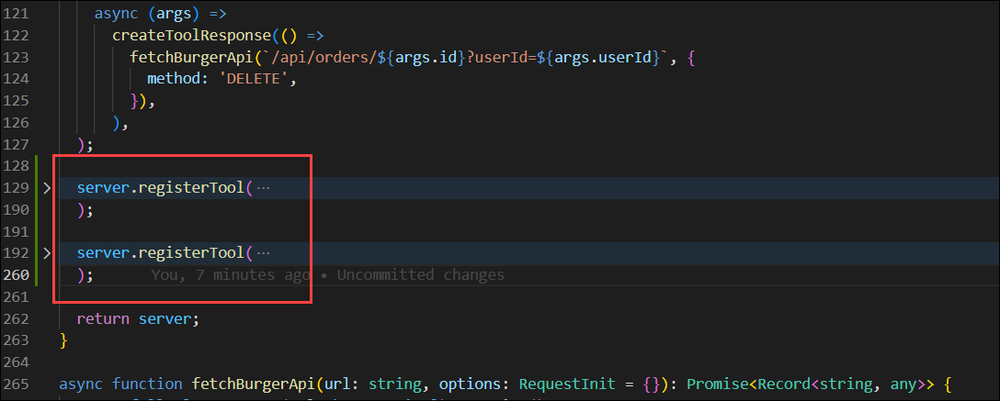

    **Quick checklist before saving:**
    - Both tools use `z.object({...})` for `inputSchema` — not a plain object
    - Both handlers are wrapped in `createToolResponse(async () => { ... })`
    - Both use `fetchBurgerApi('/api/...')` — not raw `fetch()`
    - `return server;` is still the last line inside `getMcpServer()`

7. Save the file with **Ctrl+S**.

    > **If something looks wrong** — for example if you accidentally modified an existing tool — you can safely undo all your changes with **Ctrl+Z** in VS Code until the file is back to its original state, then repeat the paste steps from step 4.

    <validation step="validate-mcp-tools-added" />


**Congratulations** on completing Task 1! Both tool definitions are in place. In the next task, you will deploy them to Azure.

---

## Task 2: Redeploy the Burger MCP Server

The code change only exists locally. To make the new tools available to all MCP clients — the web chat, the MCP Inspector, and GitHub Copilot — you need to redeploy the `burger-mcp` service to Azure. Only this one service needs redeploying; nothing else changes.

### Steps

1. Open **VS Code Terminal** and navigate to the project root:

   ```bash
   cd mcp-agent-langchainjs
   ```

2. Deploy only the `burger-mcp` service:

   ```bash
   azd deploy --service burger-mcp
   ```

   You will see the packaging and upload progress in the terminal. This typically takes 1–2 minutes.

   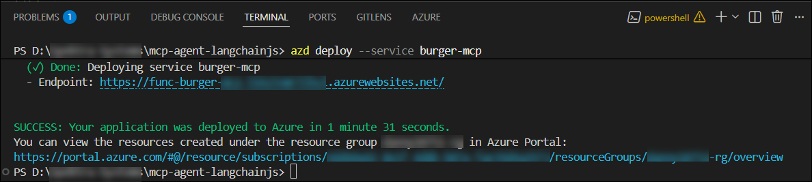

3. Once deployment is complete, restart the Burger MCP Function App to ensure the new code is picked up cleanly:

   ```bash
   az functionapp restart \
     --name <your-burger-mcp-function-app-name> \
     --resource-group <inject key="ResourceGroupName"></inject>
   ```

   > **Don't know the function app name?** Run:
   >
   > ```bash
   > az functionapp list --resource-group <inject key="ResourceGroupName"></inject> --query "[].name" --output table
   > ```
   >
   > Look for the one prefixed with `func-burger-mcp-`.

   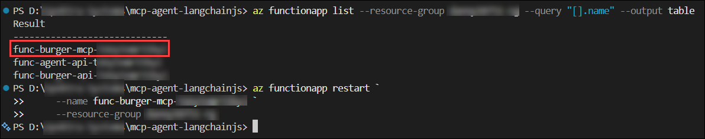

4. Wait 30 seconds, then verify the new tools are live by checking the MCP server's tool list directly. Run the MCP Inspector again:

   ```bash
   npx -y @modelcontextprotocol/inspector
   ```

   Connect to your Burger MCP URL and click **List Tools** in the Tools tab. You should now see **11 tools** — the original 9 plus your two new ones: `get_order_estimated_wait` and `get_menu_recommendation`.

   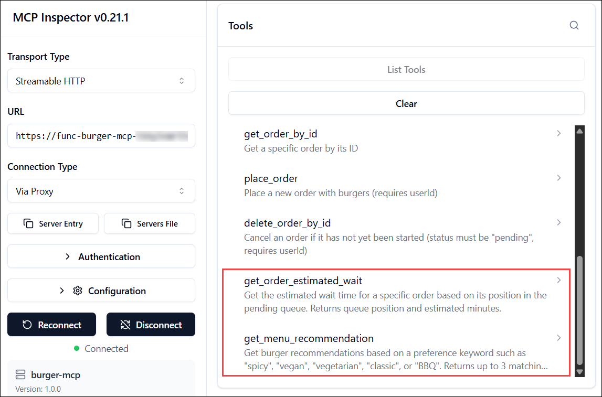

   > **If you still see only 9 tools**, wait another 30 seconds and refresh the Inspector connection. Flex Consumption Function Apps take a moment to warm up after a restart.

<validation step="validate-burger-mcp-redeployed" />

> **Congratulations** on completing Task 2! Your two new tools are live on Azure. Every MCP-compatible client connected to your server will automatically discover them on their next connection.

---

## Task 3: Test the New Tools Across Web Chat and GitHub Copilot

With the tools deployed, it is time to put them through their paces. You will test both tools via the MCP Inspector first (direct, no AI), then via the agent web chat (AI-driven), and finally through GitHub Copilot in VS Code — confirming the same tools work identically across all three clients.

### Steps

#### Part A — Test via MCP Inspector

1. In the **MCP Inspector** (still open from Task 2), click on **`get_menu_recommendation`** in the Tools tab.

2. In the input field for `preference`, type `Vegan` and click **Run Tool**. You should receive a JSON response listing the spiciest burgers on the menu.

   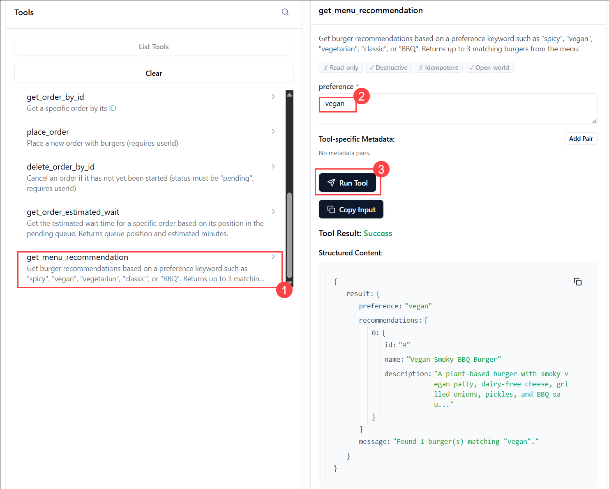

3. Try a second preference — type `Spicy` and run again. Confirm you get different results.

   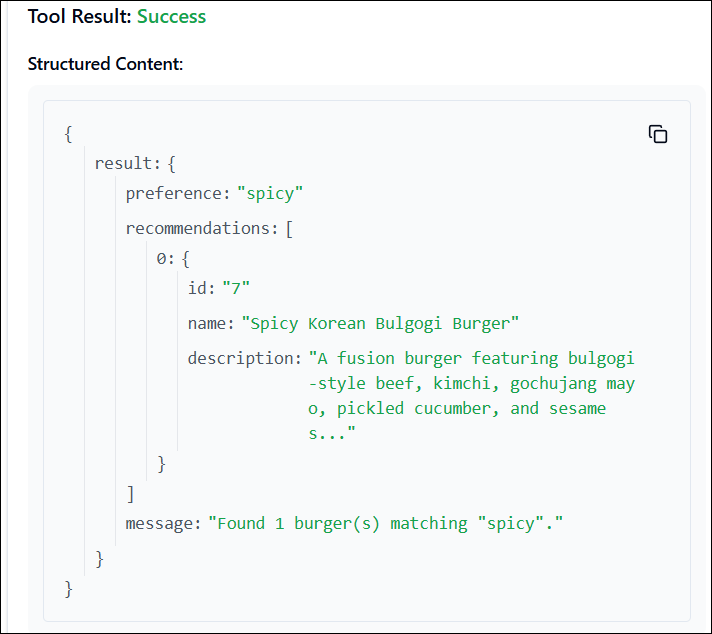

4. Now click on **`get_order_estimated_wait`**. For this tool you need a real order ID — place a quick order through the web chat first if you do not have a pending one, or use one from lab 02.

   > **Get a pending order ID quickly** — send this message in the Agent Web App:
   > _"Place an order for any burger"_
   > The response will include your order ID.

5. Paste the order ID into the `orderId` input field and click **Run Tool**. You should see the queue position and estimated wait time.

   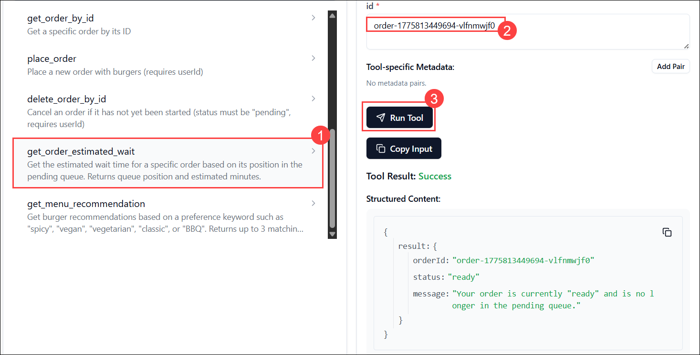

#### Part B — Test via the Agent Web Chat

6. Open your **Agent Web App URL** in a browser and start a new chat session.

7. Test `get_menu_recommendation` through the agent:

   _"Can you recommend something spicy from the menu?"_

   The agent will call `get_menu_recommendation` with `preference: "spicy"` and present the results in a formatted, readable response.

   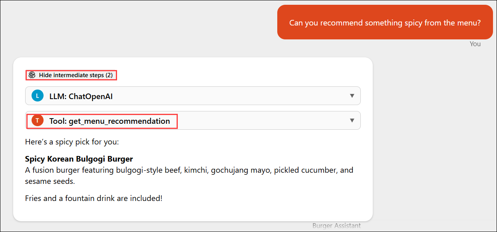

8. Try a different preference to see the tool in action again:

   _"I'm vegetarian — what do you have for me?"_

9. Now test `get_order_estimated_wait` through the agent. First place an order if you do not have a pending one:

   _"Order one Classic Cheeseburger for me"_

10. Once the order is placed, ask:

    _"How long will my order take?"_

    The agent will call `get_orders` to find your most recent pending order, then call `get_order_estimated_wait` with that order ID — chaining two tools together to answer a single question.

    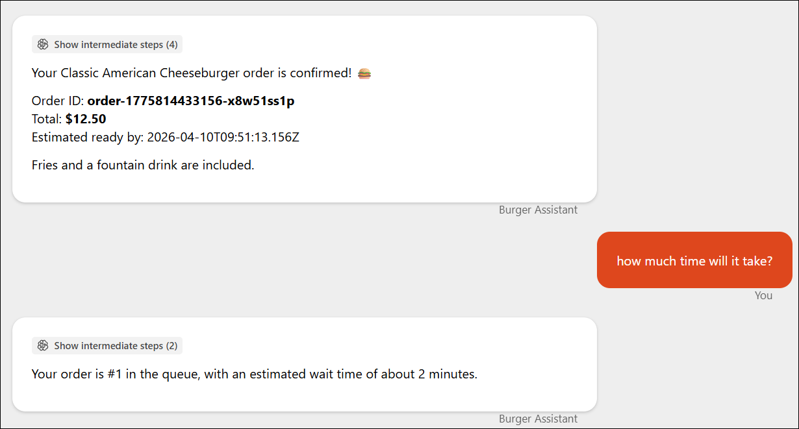

    > **This is the chaining pattern in action.** The agent did not know your order ID — it figured out it needed to call `get_orders` first, extracted the ID, then called `get_order_estimated_wait`. You wrote the tool; the agent figured out how to use it.

#### Part C — Test via GitHub Copilot

11. Open **VS Code** and the GitHub Copilot Chat sidebar in Agent Mode. The `.vscode/mcp.json` you configured in lab 03 will automatically pick up the new tools on reconnect.

    >If the tools do not appear immediately, click the **Restart** button next to the `burger-mcp` server or open the **Command Palette (Ctrl+Shift+P)**, select "MCP: List Servers," click your server, and choose "Start Server".

    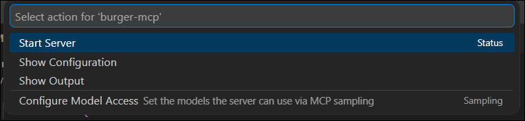

12. Verify the new tools appear in the Copilot tools list — you should now see `get_menu_recommendation` and `get_order_estimated_wait` alongside the original 9. You can verify it by clicking the **Tools** icon in the Copilot chat input box and browsing the list.

    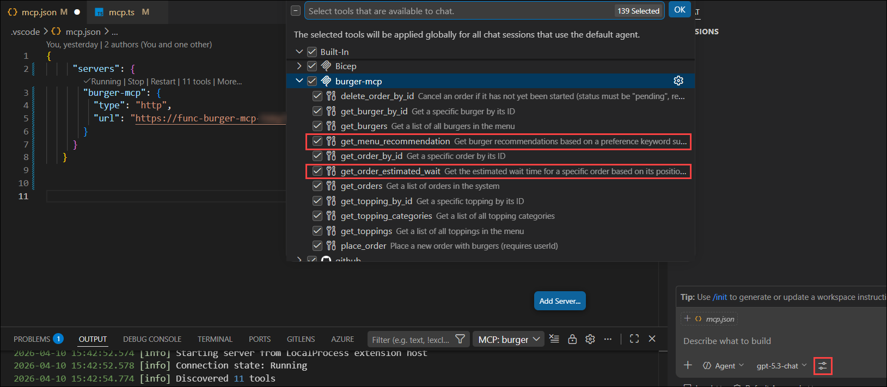

13. Test the recommendation tool from Copilot:

    `"recommend me a BBQ burger"`

    >**Note:** For copilot to use burger mcp tools, use **#burger-mcp** in your prompt to ensure it picks the right server.

     Copilot will call `get_menu_recommendation` with `preference: "BBQ"` and present the results in a natural language response. Ensure you click `allow in this session` when the permission pop-up appears.

    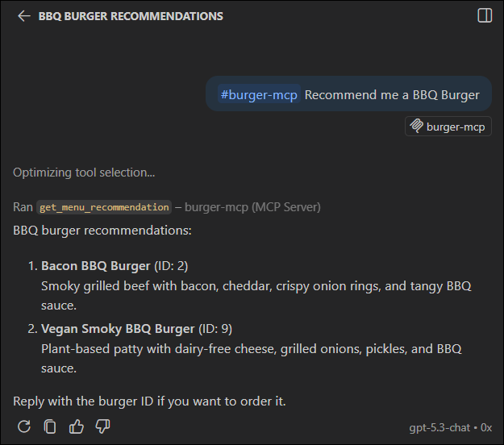

14. Test the wait time tool from Copilot:

    `"Place an order for the first burger you recommended, then tell me how long it will take"`

    Copilot will call `place_order` followed by `get_order_estimated_wait` — all from inside VS Code.

    If prompted for **userId**, enter the unique string you used in the previous lab **(Member Card)**.

    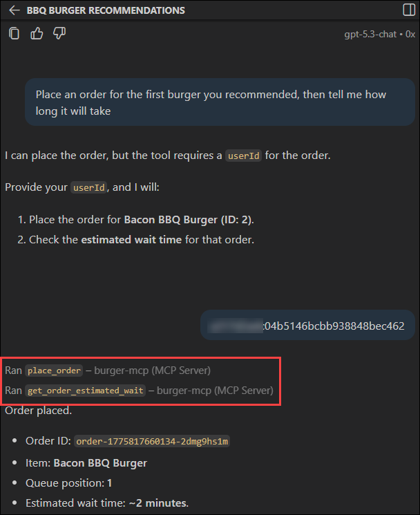

15. Switch to your **Burger Web App** tab and confirm the order placed through Copilot appears on the live dashboard.

    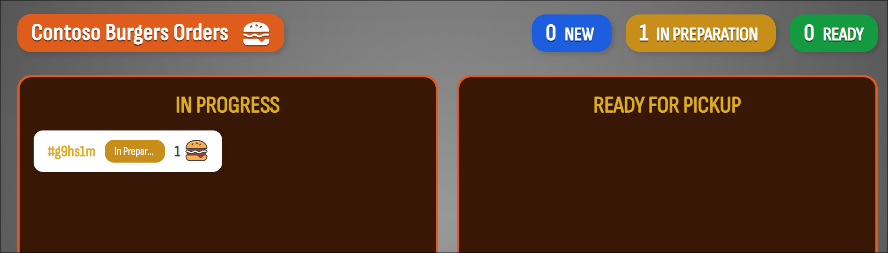

<validation step="validate-new-tools-tested" />

> **Congratulations** on completing Exercise 4 and the entire lab!

---

## Summary

In this exercise, you:

- Added two new read-only MCP tools — **`get_order_estimated_wait`** and **`get_menu_recommendation`** — to the Burger MCP Server source code by appending new `server.registerTool()` blocks without modifying any existing code
- Redeployed only the `burger-mcp` service using `azd deploy --service burger-mcp`, leaving all other services untouched
- Verified the new tools were live by checking the tool count in the MCP Inspector went from 9 to 11
- Tested both tools directly via the Inspector, through the web chat agent, and through GitHub Copilot in VS Code — confirming all three clients discovered and used the new tools automatically

---

## Lab Conclusion

Over the course of this lab, you have:

- **Configured Azure OpenAI** as the reasoning engine and learned why endpoint format and API version matter
- **Seeded a live Cosmos DB database** using GenAIScript and validated the agent responds with real data
- **Explored the Model Context Protocol** end-to-end — from the raw tool definitions in code, to calling them via the MCP Inspector, to watching the LangChain.js agent chain multiple tools together automatically
- **Integrated the same MCP server with GitHub Copilot** in VS Code — ordering burgers from your IDE with zero changes to the server
- **Extended the system with two new custom tools** and experienced the full development lifecycle: write → deploy → test across multiple clients

The pattern you applied here — a standardized MCP server powering multiple AI clients — is directly transferable to any real-world domain. Swap "burgers" for inventory management, customer support tickets, booking systems, or IoT devices, and the architecture remains identical.

## Happy Building! 🍔
